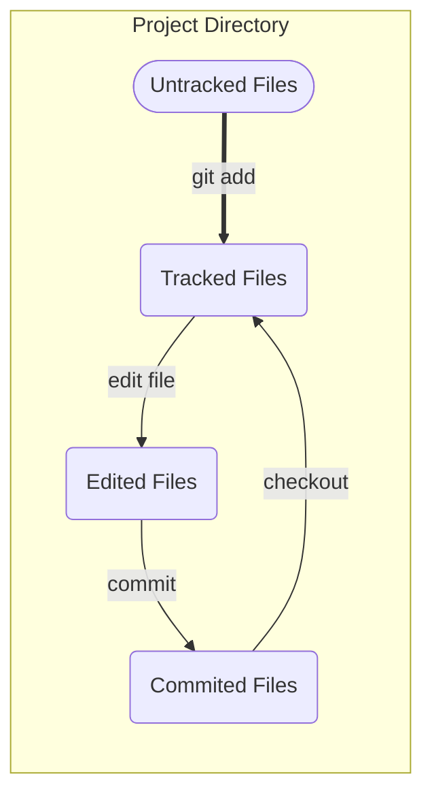

## Introduction to Version Control Systems (VCS)
### Local VCS

Many people’s version-control method of choice is to copy files into another (time-stamped) directory. 

> :heavy_check_mark: Simple
>
> :x: Error-prone

### Improved local VCS

VCS with a simple database that kept all the changes to files. One of the most popular VCS tools was *RCS*, which keeps patch sets (differences between files) in a special format on disk.

> :x: Collaboration with other developers is difficult

### Centralized VCS

CCVSs (such as *CVS*, *Subversion*, and *Perforce*) have a single server that contains all the versioned files and all clients that check out files from that central server.

> :heavy_check_mark: Collaboration with fine-grained permission control
>
> :x: Single-point failures of the central server, such as the server going down and a corrupted drive (you'll lose everything!)

### Distributed VCS

In DVCSs (such as *Git*, *Mercurial*, *Bazaar*, and *Darcs*), clients don't just check out the latest snapshot of the files but rather ***fully mirror the repository***, including the full history.

> :heavy_check_mark: Full backup at each client
>
> :heavy_check_mark: More flexible collaboration 

## Git in a Nutshell

### Snapshots

Git stores its data as a series of snapshots of a **miniature filesystem**, which is like a ***stream of snapshots***.

> Other VCSs store their data as a set of ***files*** and ***changes*** made to each file over time (This is called delta-based version control). 

### Local

> :heavy_check_mark: No network latency overhead

### Integrity

Everything in Git is checksummed ([SHA-1](https://en.wikipedia.org/wiki/SHA-1) hash) before it is stored and is then referred to by that checksum. It's impossible to change the content of any file or directory without Git knowing about it.

### Undoable

In *Git*, almost all of your actions only add data to the Git database. It's hard to get the system to do anything that is not undoable.

> Happy experimenting! You won't screw up.:smiley:

### The Three Status :dart: 

In *Git*, files only have three status

1. *modified*

   You have ***changed*** the file, but have ***not committed*** it to your database yet. 

2. *staged* / *indexed*

   You have ***marked a modified file*** in the *current version* to go into your *next commit snapshot*.

3. *committed* / *unmodified*

   The file is ***safely*** stored in your local database.

Those three status leads to three sections of a Git project

1. Working tree

   A ***checkout*** of one version of the project. Files are pulled out of the compressed database and placed in your ***working directory***.

2. Staging area

   A *file* in your ***git directory*** (aka, `.git`) which stores information about what will go into your next commit. Its technical name in Git parlance is the `index`.

3. Git directory

   A *folder* where git stores the metadata and object database of your project.

```shell
$ pwd
/Users/zheng/Documents/GitHub/fun-with-home-lab

$ ls -al
drwxr-xr-x  15 zheng  staff    480 Aug 12 17:32 .git          
# This is the git directory, the staging area is a file inside it.
-rw-r--r--   1 zheng  staff  35149 Aug  6 18:01 LICENSE
-rw-r--r--   1 zheng  staff    155 Aug  6 18:01 README.md
# This is the working tree
```



## Git Configuration Files

### System Level Configuration

:page_facing_up: `/etc/gitconfig` 

```shell
# Every user and all their repositories
$ git config --system
```

*Need superuser privilege to make changes to it.

### User Level Configuration

 :page_facing_up:`~/.gitconfig` or `~/.config/git/config`

```shell
# Every user and all their repositories
$ git config --global
```

### Project Configuration

:page_facing_up: `.git/config`

```shell
# Every user and all their repositories
$ git config --local  # Default without --local
```

\*Each level overrides values in the previous level.

### Useful Commands

```shell
# View all of your settings and where they are coming from
$ git config --list --show-origin

# Identity configurations, using user level as example
$ git config --global user.name "John Doe"
$ git config --global user.email johndoe@example.com
```

## Git Basics

### Initialize a Repository

Start from an existing directory

```shell
# CD into the folder first
$ cd ~/Documents/Github/demo

# Initialization

$ git init 
# This will create a subdirectory named .git, but nothing is being tracked yet.

$ git add *
$ git add LICENSE
$ git commit -m 'Initialization'
```

Start from a remote repository

```shell
$ git clone https://github.com/ZhengYuan-Public/fun-with-lectures
```

### File Status

To check file status, use `git status`.

```shell
$ git status

On branch main
Your branch is up to date with 'origin/main'.
```

#### Untracked

> Nothing interesting here, take it easy. :smirk:

#### Tracked

- **modified**

- **staged** / **indexed**

- **committed** / **unmodified**

```shell
# To see what have been changed but not staged
$ git diff

# To see what have been staged that will go into next version/commit
$ git diff --staged
$ git diff --cached
```

#### Ignored

:page_facing_up: `.gitignore`

Matching Patterns

- Blank lines or lines starting with `#` are ignored
- Standard [glob patterns](https://en.wikipedia.org/wiki/Glob_(programming)) work and will be applied recursively
- ***Start*** glob pattern with `/` to avoid recursivity
- ***End*** glob pattern with `/` to specify a directory
- Negate a pattern by starting it with an exclamation `!`

| **Wildcard** |           Explanation           |                    Example                     |
| :----------: | :-----------------------------: | :--------------------------------------------: |
|     `*`      |     zero or more characters     |                       /                        |
|     `?`      |          one character          |                       /                        |
|   `[abc]`    | matches any character inside it |                       /                        |
|  `[a-zA-z]`  |      match all characters       |                       /                        |
|   `[0-9]`    |        match all numbers        |                       /                        |
|     `**`     |    match nested directories     | `a/**/z` will match `a/z`, `a/b/z`, `/a/b/c/z` |

### File Operations

#### Add, Remove, and Move

```shell
# Start tracking
$ git add <file_name>

# Stop tracking
$ git rm <file_name>
# Remove staged file
$ git rm --cached <file_name>
# Move files
$ git mv file_src filt_dst
```

#### Commit

```bash
# Commit staged/cached/indexed files
$ git commit -m "commit_message" -v "commit_details"

# Skip the staging area. This will automatically stage every file 
# that is already tracked before doing the commit
$ git commit -a 

# Commit history
$ git log

# Only last 2 commits
$ git commit --patch 2
$ git commit -p 2

# More abbreviated stats
$ git log --stat

$ git log --pretty=oneline
$ git log --pretty=format:"%h - %an, %ar : %s"

$ git log --since=2.weeks
$ git log --since="2008-10-01"
```

#### Undoing 

##### Amend Commit

```shell
# If you just need to make some minor changes, such as adding some files or editing 
# the commit message. This will result in a single commit
$ git commit -m "commit_message" -v "commit_details"
$ git add <forgotten_file>
$ git commit --amend
```

##### Unstaging a Staged File

```shell
$ git reset HEAD <file_name>
```

\*This is a dangerous command, especially if you provide the `--hard` flag.

##### Unmodifying a Modified File

```shell
$ git checkout -- <file_name>
```

\*This is a dangerous command, the file will be replaced with the most recently-committed version.

##### Reset vs. Revert vs. Restore

[How to Undo Changes in Git (reset vs revert vs restore)](https://blog.git-init.com/how-to-undo-changes-in-git-using-reset-revert-and-restore/) :link:

- ***reset***: is about *updating your branch*, moving the tip in order to add or remove commits from the branch. This operation *changes the commit history*.

- ***restore***: is about *restoring files* in the working tree from either the index or another commit. This command does *not update your branch*. The command can also be used to restore files in the index from another commit.

- ***revert***: is about making a *new commit* that reverts the changes made by other commits.

### Remote Repositories

#### Checking Status

```shell
# Which remote servers you have configured
$ git remote
origin

$ git remote -v
$ git remote --verbose
name_1  https://github.com/<user_name>/<repo_name>.git (fetch)
name_1  https://github.com/<user_name>/<repo_name>.git (push)
name_0  https://github.com/<user_name>/<repo_name>.git (fetch)
name_0  https://github.com/<user_name>/<repo_name>.git (push)
origin  https://github.com/<user_name>/<repo_name>.git (fetch)
origin  https://github.com/<user_name>/<repo_name>.git (push)
```

#### Add, Rename, and Remove

```shell
# Add a remote repository
$ git remota add <name> <remote_repo>
$ git fetch <name>

# Rename a remote repository
$ git remote rename <old_name> <new_name>

# Remove a remote repository
$ git remote remove <name>
```

#### Pushing

> Origin is the default name when you clone a repository.

```shell
$ git push <remote> <branch>

# Example
$ git push origin main
```

*Git does not transfer tags to remote servers by default. Use `--tag` or `git push <remote> <tag_name>`

#### Inspecting

```shell
$ git remote show <name>
```

#### Tagging

> Tag specific points in a repository’s history as being important. 
>
> > Typically, people use this functionality to mark release points

```shell
# List tags
$ git tag

# List tags with wildcard pattern
$ git tag -l "v1.5.2*"

# Create an annotated tag
$ git tag -a v1.0.0 -m "Version 1.0.0"

# Create lightweight tag
$ git tag v1.0.0-lw

# Tag previous commit
$ git git tag -a v0.9.9 9fceb02

# Transfer tags with remote
$ git push <remote> <tag_name>
$ git push origin v1.0.0-lw

# Delete local tags
$ git tag -d v1.0.0-lw

# Delete remote tags
$ git push origin :refs/tags/<tagname>
$ git push origin --delete <tagname>

# Checkout tags - View the versions of files a tag is pointed to.
$ git checkout <tagname>
```

#### Undoing

Undo a commit which was already pushed to the remote repository

```shell
$ git log
commit 394db8ca956b59f24ba1cbda4a4675e173eb2a61 (HEAD -> main, origin/main, origin/HEAD)
Author: Zheng Yuan <zhengyuan.contact@gmail.com>
Date:   Thu Aug 17 01:11:51 2023 +0800

    Update

    Update

commit d65b348abf111056a5e064f27391872fabfeeba6
Author: Zheng Yuan <zhengyuan.contact@gmail.com>
Date:   Thu Aug 17 00:46:45 2023 +0800

    Update 2019-01-06-PythonNotes.md

    Update formatting.

commit 7d61b34ba70746776a48d5411de588254720da5d
Merge: e8659c1 180fee1
Author: Zheng Yuan <zhengyuan.contact@gmail.com>
Date:   Thu Aug 17 00:46:35 2023 +0800

    Merge branch 'main' of https://github.com/ZhengYuan-Public/zhengyuan-public.github.io
```

If I'd like to roll back to the version with hash ID `7d61b34ba70746776a48d5411de588254720da5d`

```shell
# Point the HEAD to previous commit with either of the following commands
git reset --hard HEAD^^

git reset --hard HEAD~2

git reset --hard 7d61b3

# Force push the remote (you may need to enable proxy in China)
git push -f origin main
```

### Git Aliases

```shell
$ git config --global alias.co checkout
$ git config --global alias.br branch
$ git config --global alias.ci commit
$ git config --global alias.st status

$ git config --global alias.unstage 'reset HEAD --'
$ git config --global alias.last 'log -1 HEAD'

# Start a command with !
$ git config --global alias.visual '!gitk'
```

## GitHub Pull Request

> Pull requests let you tell others about changes you've pushed to a branch in a repository on GitHub. Once a pull request is opened, you can discuss and review the potential changes with collaborators and add follow-up commits before your changes are merged into the base branch.

1. Navigate to the repo which you'd like to contribute to 
2. Fork it (create a copy of another user's repo)
3. Clone the forked repo into your local machine
4. Develop, commit and push
5. Open a Pull Request on GitHub at the forked repo
